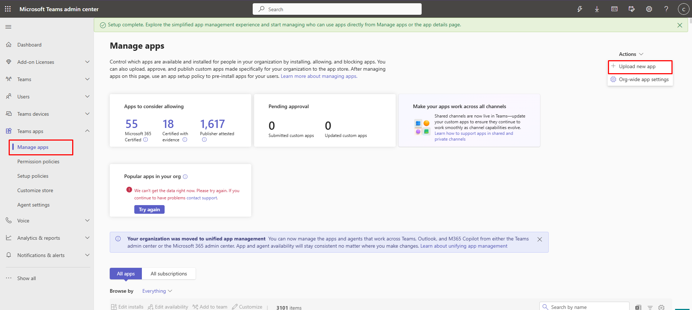

# Deployment Guide

This guide describes the intended reusable deployment path for a target/client tenant.

## Deployment Summary

```text
Prepare tenant inputs
  -> discover-prereqs.ps1
  -> deploy.ps1
  -> Terraform runtime
  -> Function package deployment
  -> Static Web Apps frontend deployment
  -> Teams manifest generation
  -> Teams app assignment group
```

## Required Tools

- Azure CLI
- Terraform
- .NET 8 SDK
- Node.js and npm
- PowerShell 7 recommended

## Required Tenant Access

For a full lab/bootstrap deployment, the operator usually needs:

- Azure subscription `Owner`, or `Contributor` plus permission to create role assignments.
- Microsoft Entra role capable of granting Graph application consent, such as Global Administrator or Privileged Role Administrator.
- Teams Administrator for publishing the Teams app package and assigning Teams app setup policies.
- Access to a licensed Exchange Online mailbox that will be used as the approval sender.

For manual identity mode, the deployment actor can use lower Azure privileges if the privileged Entra app registration, secret, consent, and optional group IDs are supplied by another team.

## Required Microsoft Graph Permissions

Default application permissions:

- `Mail.Send`
- `User.ReadWrite.All`

Optional permission for static group-based licensing:

- `GroupMember.ReadWrite.All`

`GroupMember.ReadWrite.All` is not needed for `DynamicGroup` licensing mode.

## Environment Configuration

Each client environment should have an ignored `terraform.tfvars` file based on:

```text
infra/environments/cholbing-dev/terraform.tfvars.example
```

Key values:

| Value | Purpose |
| --- | --- |
| `environment_name` | Short client/environment name used in Azure resource names. |
| `location` | Azure region for core runtime resources. |
| `static_web_app_location` | Azure Static Web Apps region. This service supports fewer regions than general Azure resources. |
| `target_tenant_domain` | Default UPN domain for generated users. |
| `msp_tenant_domain` | MSP tenant/domain tag value. |
| `graph_tenant_id` | Target tenant ID. |
| `graph_client_id` | Graph app registration client ID. |
| `graph_client_secret_value` | Raw secret for lab/bootstrap scenarios. |
| `graph_client_secret_key_vault_secret_id` | Existing Key Vault secret reference for manual identity mode. |
| `approval_recipient_email` | MSP/service desk mailbox. |
| `approval_sender_user_principal_name` | Licensed target-tenant sender mailbox. |
| `approval_token_signing_key` | HMAC key for approval links. |
| `license_assignment_mode` | `None`, `DynamicGroup`, or `StaticGroup`. |
| `license_group_id` | Group object ID for `StaticGroup` mode. |

## Discovery

From the environment folder:

```powershell
.\discover-prereqs.ps1 -WriteTfvars
```

The script signs in with Azure CLI, lets the operator select tenant, subscription, core Azure region, Static Web Apps region, deployment path, approval addresses, and licensing mode.

## Main Deployment

From `BasicTeamsAppInfDeploy`:

```powershell
.\deploy.ps1
```

Useful options:

```powershell
.\deploy.ps1 -ApprovalProvider Logging
.\deploy.ps1 -ApprovalProvider Graph
.\deploy.ps1 -RunGraphReadiness
.\deploy.ps1 -TeamsAppUserPrincipalName user@contoso.onmicrosoft.com
```

Use `Logging` while Graph consent or mailbox provisioning is incomplete. Use `Graph` for real approval email delivery.

## Teams App

After deployment, the generated manifest is written to:

```text
teams-app/manifest/.generated/manifest.json
```

Create the uploadable Teams app package:

```powershell
.\infra\environments\cholbing-dev\new-teams-package.ps1
```

Publish the package and assign it to the Teams app group:

```powershell
.\infra\environments\cholbing-dev\publish-teams-app.ps1
```

The script uploads the generated package as an organization app, creates a Teams setup policy, pins the app, and assigns that policy to the Entra group. It uses Microsoft Teams PowerShell with device-code authentication.

The same step can be run from the main deployment wrapper:

```powershell
.\deploy.ps1 -PublishTeamsApp -TeamsAppUserPrincipalName user@contoso.onmicrosoft.com
```

Manual upload is also supported from Teams admin center:

1. Open Teams admin center.
2. Go to **Teams apps** -> **Manage apps**.
3. Select **Upload new app**.
4. Upload `teams-app/manifest/.generated/m365-onboarding-teams-app.zip`.




## Runtime Validation

Validate the Function App:

```powershell
.\infra\environments\cholbing-dev\test-function-deployment.ps1
```

Validate Graph consent:

```powershell
.\infra\environments\cholbing-dev\test-graph-app.ps1
```

Attempt admin consent when using a sufficiently privileged account:

```powershell
.\infra\environments\cholbing-dev\test-graph-app.ps1 -AttemptAdminConsent
```
